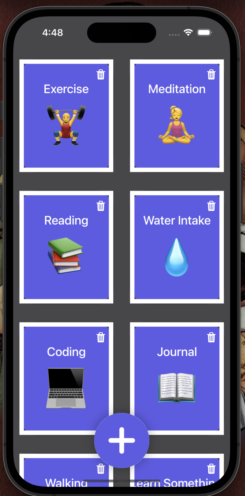

# Habit Tracker

HabitTracker is a powerful SwiftUI-based iOS app designed to help you form and maintain positive habits. Track your daily routines, from exercise and meditation to reading and more, with a visually appealing and easy-to-use interface. Never miss a day of your habits and stay motivated to reach your goals.

  

## Description

HabitTracker is a powerful SwiftUI-based iOS app designed to help you form and maintain positive habits. Track your daily routines, from exercise and meditation to reading and more, with a visually appealing and easy-to-use interface. Never miss a day of your habits and stay motivated to reach your goals.

## Features

- **Create Custom Habits**: Add your own habits and personalize them with names, descriptions, and emojis.
- **Track Progress**: Monitor your daily progress and maintain a streak for each habit.
- **Easy Deletion**: Remove habits you no longer want to track with a simple swipe.
- **Dark Mode Support**: Comfortable usage in low-light conditions with a beautifully designed dark mode.
- **User-Friendly Design**: An intuitive and visually appealing UI to keep you motivated.

## Getting Started

1. Clone the repository to your local machine.
2. Open the project in Xcode.
3. Build and run the app on your iOS device or simulator.

## How to Use

1. Add a new habit by tapping the plus icon.
2. Customize the habit name, description, and emoji.
3. Start tracking your progress and build a streak.
4. Swipe to delete habits you've completed or no longer wish to track.

## Authors

- Joseph Patrick Zoll (jpzoll@syr.edu)
